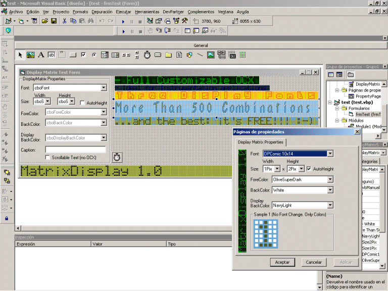



## Display Matrix \(Professional Look Like\) OCX

### Description

This OCX simulates the screen of a dot Display. It's  full customizable and very very easy to use. This is ideal for instrumentation applications. I have seen similar OCX like this for more than 60$ O_o. As you can see this is very accurate. Enjoy.
 
### More Info
 

             |
---                |---
**Submitted On**   |2004-03-10 11:55:34
**By**             |[John Ripper](https://github.com/Planet-Source-Code/PSCIndex/blob/master/ByAuthor/john-ripper.md)
**Level**          |Beginner
**User Rating**    |4.9 (49 globes from 10 users)
**Compatibility**  |VB 4\.0 \(32\-bit\), VB 5\.0, VB 6\.0
**Category**       |[OLE/ COM/ DCOM/ Active\-X](https://github.com/Planet-Source-Code/PSCIndex/blob/master/ByCategory/ole-com-dcom-active-x__1-29.md)
**World**          |[Visual Basic](https://github.com/Planet-Source-Code/PSCIndex/blob/master/ByWorld/visual-basic.md)
**Archive File**   |[Display\_Ma1718673102004\.zip](https://github.com/Planet-Source-Code/john-ripper-display-matrix-professional-look-like-ocx__1-52288/archive/master.zip)

